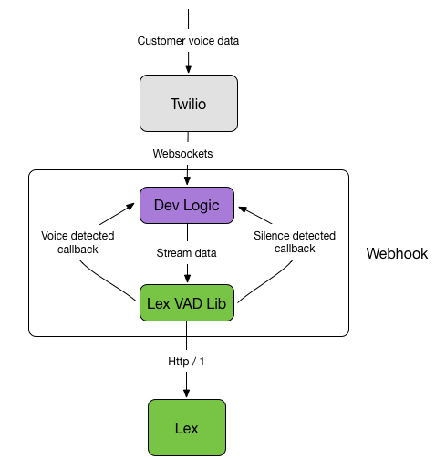
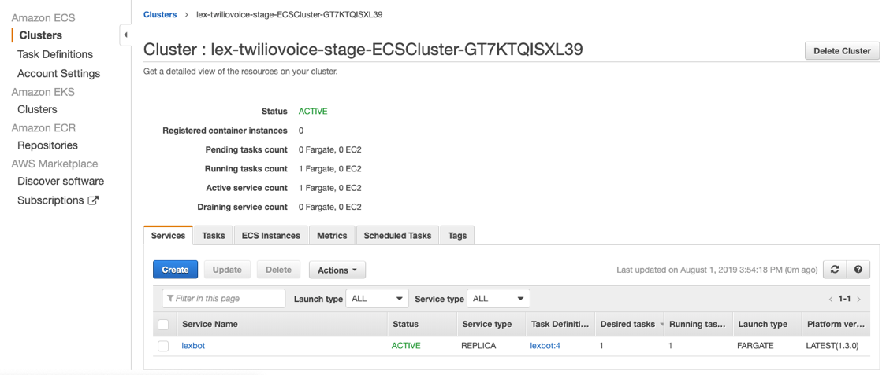
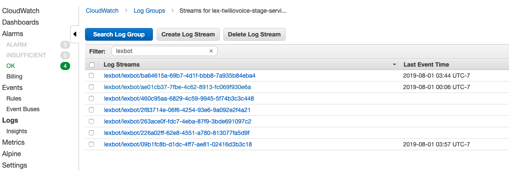
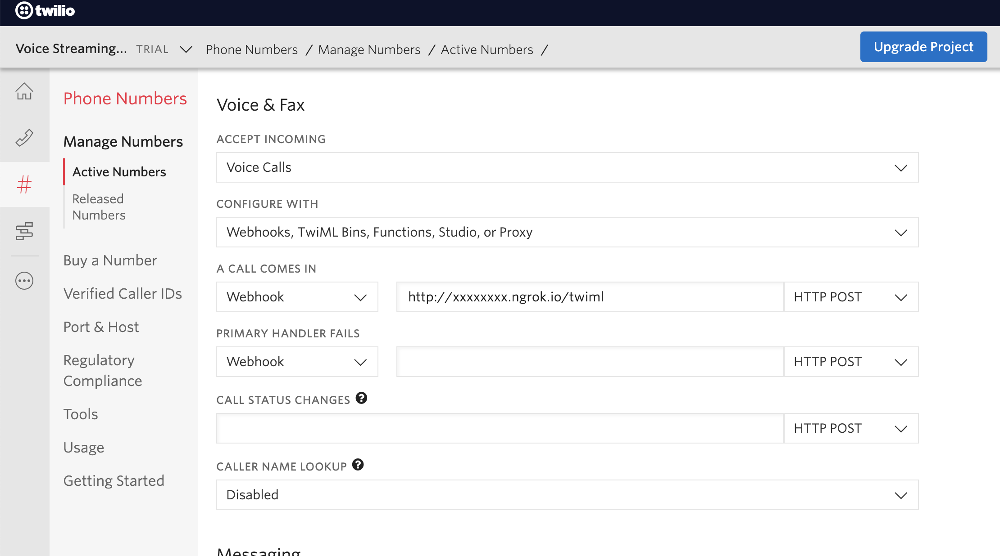

## Use Amazon Lex as a conversational interface with Twilio Media Streams

Businesses use the Twilio platform to build the forms of communication
they need to best serve their customers: whether it’s fully automating
food orders of a restaurant with a conversational IVR or building the
next generation advanced contact center. With the launch of  [Media Streams](https://www.twilio.com/media-streams), Twilio is opening up their Voice
platform by providing businesses access to the raw audio stream of their
phone calls in real time.

You can use Media Streams to increase productivity in the call center by
transcribing speech in real time with [Amazon
Transcribe Streaming
WebSockets](https://aws.amazon.com/blogs/aws/amazon-transcribe-streaming-now-supports-websockets/)
or to automate end-user interactions and make recommendations to agents
based on the caller’s intent using Amazon Lex.

In this blog post, we show you how to use [Amazon
Lex](https://aws.amazon.com/lex/) to integrate conversational interfaces
(chatbots) to your voice application. This enables you to recognize the
intent of speech and build highly engaging user experiences and lifelike
conversations. We use Twilio Media Streams to get access to the raw
audio stream from a phone call in near real time.

The solution follows these steps:

1.  Receive audio stream from Twilio

2.  Send the audio stream to a voice activity detection component to
    determine voice in audio

3.  Start streaming the user data to Amazon Lex when voice is detected

4.  Stop streaming the user data to Amazon Lex when silence is detected

5.  Update the ongoing Twilio call based on the response from Amazon Lex

The Voice activity detection (VAD) implementation provided in this
sample is for reference/demo purpose only and uses a rudimentary
approach to detect voice and silence by looking at amplitude. It is not
recommended for production use. You will need to implement a robust form
of VAD module as per your need for use in production scenarios.

The diagram below describes the steps:

The instructions for integrating an Amazon Lex Bot with the Twilio Voice
Stream are provided in the following steps:

> Step 1: Create an Amazon Lex Bot
> 
> Step 2: Create a Twilio Account and Setup
> Programmable Voice
> 
> Step 3: Build and Deploy the Amazon Lex and
> Twilio Voice Stream Integration code to Amazon ECS/Fargate
> 
> Step 4: Test the deployed service
> 
> As an optional next step, you can build and test the service locally.
> For instructions see, Step 5(Optional): Build and Test the service
> locally

To build and deploy the service, the following pre-requisites are
needed:

1.  [Python ](https://www.python.org/downloads/)(The language used to
    build the service)

2.  [Docker](https://www.docker.com/products/docker-desktop) (The tool
    used for packaging the service for deployment)

3.  [AWS CLI](https://aws.amazon.com/cli/) installed and configured (For
    creating the required AWS services and deploying the service to
    AWS). For instructions see, [Configuring AWS
    CLI](https://docs.aws.amazon.com/cli/latest/userguide/cli-chap-configure.html#cli-quick-configuration)

In addition, you need a domain name for hosting your service and you
must register an SSL certificate for the domain using [Amazon
Certificate Manager](https://console.aws.amazon.com/acm/home). For
instructions, see [Request a public
Certificate](https://docs.aws.amazon.com/acm/latest/userguide/gs-acm-request-public.html).
Record the Certificate ARN from the console.

An SSL certificate is needed to communicate securely over **wss**
(WebSocket Secure), a persistent bidirectional communication protocol
used by the Twilio voice stream. The \<Stream\> instruction in the
templates/streams.xml file allows you to receive raw audio streams from
a live phone call over WebSockets in near real-time. On successful
connection, a WebSocket connection to the service is established and
audio will start streaming.

# Step 1: Create an Amazon Lex Bot

If you don’t already have an Amazon Lex Bot, create and deploy one. For
instructions, see [Create an Amazon Lex Bot
Using a Blueprint
(Console)](https://docs.aws.amazon.com/lex/latest/dg/gs-bp.html).

Once you’ve created the bot, deploy the bot and create an alias. For
instructions, see [Publish a Version and Create
an
Alias](https://docs.aws.amazon.com/lex/latest/dg/gettingstarted-ex3.html).

In order to call the Amazon Lex APIs from the service, you must create
an IAM user with an access type “Programmatic Access” and attach the
appropriate policies.

For this, in the AWS Console, go to IAM-\>Users-\>Add user

Provide a user name, select “Programmatic access” Access type, then
click on “Next: Permissions”

Using the “Attach existing policies directly” option, filter for Amazon
Lex policies and select AmazonLexReadOnly and AmazonLexRunBotsOnly
policies.

Click “Next: Tags”, “Next: Review”, and “Create User” in the pages that
follow to create the user. Record the access key ID and the secret
access key. We use these credentials during the deployment of the stack.

# Step 2: Create a Twilio account and setup programmable voice 

Sign up for a Twilio account and create a programmable voice project.

For sign-up instructions, see **<https://www.twilio.com/console>.**

Record the “**AUTH TOKEN”.** You can find this information on the Twilio
dashboard under Settings-\>General-\>API Credentials.

You must also verify the caller ID by adding the phone number that you
are using to make calls to the Twilio phone number. You can do this by
clicking on the  button on the Verify caller IDs
page.

#   

# Step 3: Build and deploy the Amazon Lex and Twilio Stream Integration code to Amazon ECS

In this section, we create a new service using AWS Fargate to host the
integration code. [AWS
Fargate](https://aws.amazon.com/fargate/) is a deployment option
in [Amazon Elastic Container
Service](https://aws.amazon.com/ecs/) (ECS) that allows you to
deploy containers without worrying about provisioning or scaling
servers. For our service, we use Python and
[Flask](https://palletsprojects.com/p/flask/)
in a Docker container behind an Application Load Balancer (ALB).

Deploy the core infrastructure

As the first step in creating the infrastructure, we deploy the core
infrastructure components such as VPC, Subnets, Security Groups, ALB,
ECS cluster, and IAM policies using a CloudFormation Template.

Clicking on the “Launch Stack” button below takes you to the AWS
CloudFormation Stack creation page. Click “Next” and fill in the
parameters. Please note that you will be using the same
“EnvironmentName” parameter later in the process where we will be
launching the service on top of the core infrastructure. This allows us
to reference the stack outputs from this
deployment.

Once the stack creation is complete, from the “outputs” tab, record the
value of the “ExternalUrl” key.

Package and deploy the code to AWS

In order to deploy the code to Amazon ECS, we package the code in a
Docker container and upload the Docker image to the Amazon Elastic
Container Registry (ECR).

The code for the service is available at the GitHub repository below.
Clone the repository on your local machine.

git clone https://github.com/aws-samplesamazon-lex-conversational-interface-for-twilio.git

cd lex-twiliovoice

Next, we update the URL for the Streams element inside
templates/streams.xml to match the DNS name for your service that you
configured with the SSL certificate in the pre-requisites section.

\<Stream url="wss://\<Your DNS\>/"\>\</Stream\>

Now, run the following command to build the container image using the
Dockerfile.

docker build -t lex-twiliovoice .

Next, we create the container registry using the AWS CLI by passing in
the value for the repository name. Record the “repositoryUri” from the
output.

aws ecr create-repository --repository-name \<repository name\>

In order to push the container image to the registry, we must
authenticate. Run the following command:

aws ecr get-login --region us-west-2 --no-include-email

Execute the output of the above command to complete the authentication
process.

Next, we tag and push the container image to ECR.

docker tag lex-twiliovoice \<repositoryUri\>/lex-twiliovoice:latest

docker push \<repositoryUri\>/lex-twiliovoice:latest

We now deploy the rest of the infrastructure using a CloudFormation
template. As part of this stack, we deploy components such as ECS
Service, ALB Target groups, HTTP/HTTPS Listener rules, and Fargate Task.
The environment variables are injected into the container using the task
definition properties.

Since we are working with WebSocket connections in our service, we
enable stickiness with our load balancer using the target group
attribute to allow for persistent connection with the same instance.

TargetGroup:

Type: AWS::ElasticLoadBalancingV2::TargetGroup

Properties:

….

….

TargetGroupAttributes:

\- Key: **stickiness.enabled**

Value: true

…

Clicking on the “Launch Stack” button below takes you to the AWS
CloudFormation Stack creation page. Click “Next” and fill in the correct
values for the following parameters that are collected from the previous
steps.

IAMAccessKeyId, IAMSecretAccessKey, ImageUrl, LexBotName, LexBotAlias,
and TwilioAuthToken. You can use default values for all the other
parameters. Make sure to use the same “EnvironmentName” from the
previous stack deployment since we are referring to the outputs of that
deployment.

Once the deployment is complete, we can test the service. However,
before we do that, make sure to point your custom DNS to the Application
Load Balancer URL.

To do that, we create an “A Record” under Route 53, Hosted Zones to
point your custom DNS to the ALB Url that was part of the core
infrastructure stack deployment (“ExternalUrl” key from output). In the
“Create Record Set” screen, in the name field use your DNS name, for
type select “A - IPv4 address”, select “Yes” for Alias field, select the
Alias target as the ALB Url, and click “Create”.

# Step 4: Test the deployed service

You can verify the deployment by navigating to the [Amazon ECS
Console](https://console.aws.amazon.com/ecs/home) and clicking on the
cluster name. You can see the AWS Fargate service under the “services”
tab and the running task under the “tasks” tab.

To test the service, we will first update the Webhook url field under
the “Voice & Fax” section in the Twilio console with the URL of the
service that is running in AWS (http://\<url\>/twiml). You can now call
the Twilio phone number to reach the Lex Bot. Make sure that the number
you are calling from is verified using the Twilio console. Once
connected, you will hear the prompt “You will be interacting with Lex
bot in 3, 2, 1. Go.” that is configured in the templates/streams.xml
file. You can now interact with the Amazon Lex bot.

You can monitor the service using the “CloudWatch Log Groups” and
troubleshoot any issues that may arise while the service is running.

# Step 5(Optional): Build and test the service locally

Now that the service is deployed and tested, you may be interested in
building and testing the code locally. For this, navigate to the cloned
GitHub repository on your local machine and install all the dependencies
using the following command:

pip install -r requirements.txt

You can test the service locally by installing “ngrok”. See
<https://ngrok.com/download> for more details. This tool provides public
URLs for exposing the local web server. Using this, you can test the
Twilio webhook integration.

Start the ngrok process by using the following command in another
terminal window. The ngrok.io url can be used to access the web service
from external applications.

ngrok http 8080

Next, configure the “Stream” element inside the templates/streams.xml
file with the correct ngrok url.

\<Stream url="wss://\<xxxxxxxx.ngrok.io\>/"\>\</Stream\>

In addition, we also need to configure the environment variables used in
the code. Run the following command after providing appropriate values
for the environment variables:

export AWS\_REGION=us-west-2

export ACCESS\_KEY\_ID=\<Your IAM User Access key ID from Step 1\>

export SECRET\_ACCESS\_KEY=\<Your IAM User Secret Access key from Step
1\>

export LEX\_BOT\_NAME=\<Bot name for the Lex Bot you created in Step 1\>

export LEX\_BOT\_ALIAS=\<Bot Alias for the Lex Bot you created in Step
1\>

export TWILIO\_AUTH\_TOKEN=\<Twilio AUTH TOKEN from Step 2\>

export CONTAINER\_PORT=8080

export URL=\<http://xxxxxxxx.ngrok.io\> (update with the appropriate url
from ngrok)

Once the variables are set, you can start the service using the
following command:

python server.py

To test, configure the Webhook field under “Voice & Fax” in the Twilio
console with the correct url (http://\<url\>/twiml) as shown below.

Initiate a call to the Twilio phone number from a verified phone. Once
connected, you hear the prompt “You will be interacting with Lex bot in
3, 2, 1. Go.” that is configured in the templates/streams.xml file. You
are now able to interact with the Amazon Lex bot that you created in
Step1.

In this blog post, we showed you how to use
[Amazon Lex](https://aws.amazon.com/lex/)
to integrate your chatbot to your voice application. To learn how to
build more with Amazon Lex, check out the
[developer
resources](https://aws.amazon.com/lex/resources/).

## License

This project is licensed under the Apache-2.0 License.

